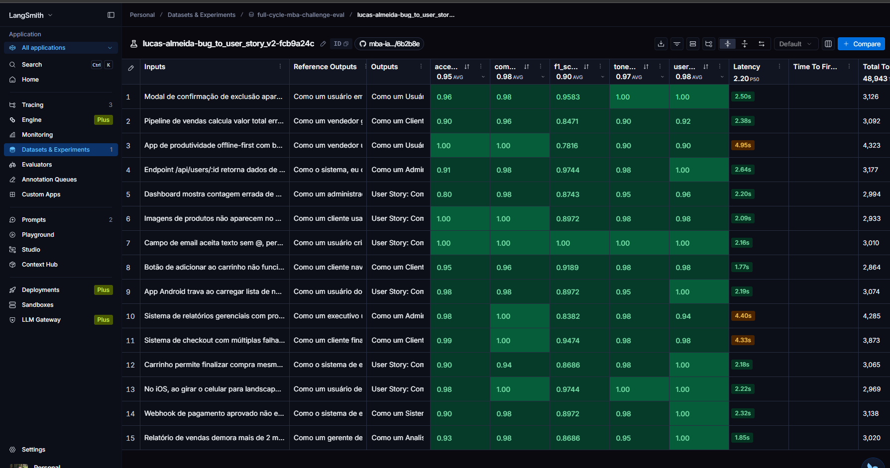
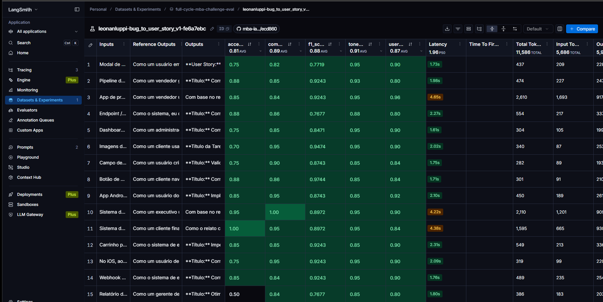
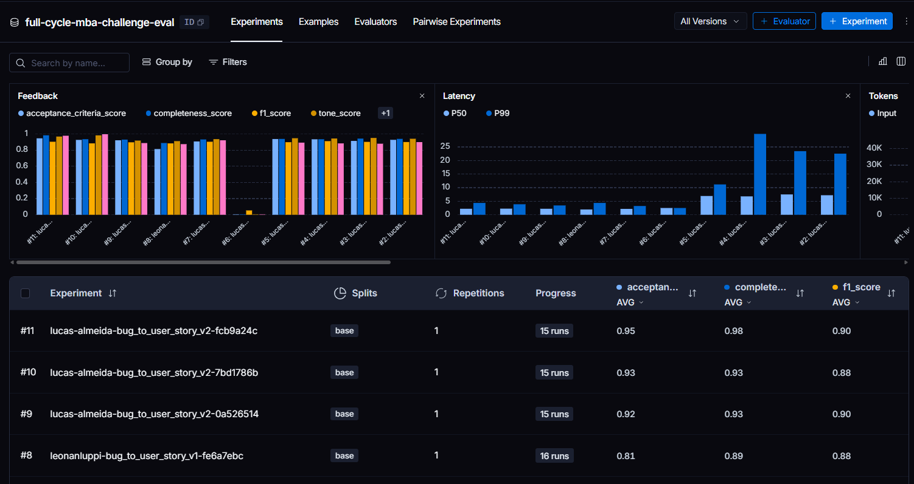
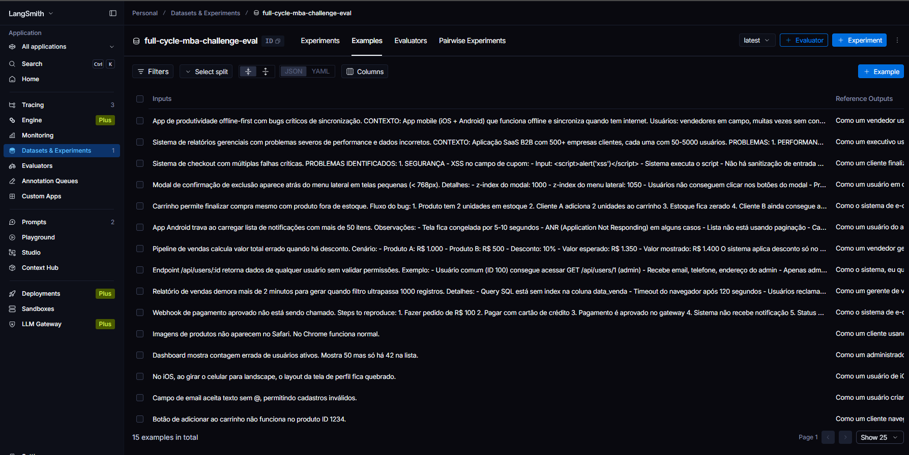

# Pull, Otimização e Avaliação de Prompts com LangChain e LangSmith

Resolução do desafio do MBA FullCycle por **Lucas Almeida**.

O projeto faz o pull de um prompt de baixa qualidade do LangSmith Prompt Hub
(`leonanluppi/bug_to_user_story_v1`), o refatora com técnicas de Prompt Engineering,
publica a versão otimizada como `lucas-almeida/bug_to_user_story_v2` e a avalia
contra 15 exemplos com 5 métricas LLM-as-judge.

- **Prompt publicado (público):** https://smith.langchain.com/hub/lucas-almeida/bug_to_user_story_v2
- **Dashboard público (dataset + experiments + traces):** https://smith.langchain.com/public/1301c56a-d9bc-4e11-b129-1bbdf88d0358/d

> O enunciado original do desafio está preservado no [Apêndice](#apêndice--enunciado-original-do-desafio), ao final.

---

## Status da entrega

| # | Requisito (`instrucoes.md`) | Status |
|---|---|---|
| 1 | Pull do prompt v1 do LangSmith → `prompts/bug_to_user_story_v1.yml` | ✅ `src/pull_prompts.py` |
| 2 | Prompt v2 otimizado com ≥ 2 técnicas | ✅ 3 técnicas (Role Prompting, Few-shot, CoT) |
| 3 | Push público para `{username}/bug_to_user_story_v2` com metadados | ✅ `src/push_prompts.py` |
| 4 | Iteração até **todas** as 5 métricas ≥ 0.9 | ✅ atingido na iteração 7 (média **0.9551**), com ressalva de margem no F1 — ver [ressalva](#ressalva-importante-sobre-a-margem-do-f1-score) |
| 5 | 6 testes de validação em `tests/test_prompts.py` | ✅ 6/6 passando |
| — | Evidências públicas no LangSmith (dataset, runs v1 e v2, traces) | ✅ ver [Evidências](#evidências-no-langsmith) |

---

## Técnicas Aplicadas (Fase 2)

O prompt otimizado está em [`prompts/bug_to_user_story_v2.yml`](prompts/bug_to_user_story_v2.yml). Foram aplicadas 3 técnicas (mínimo exigido: 2):

| Técnica | Por que foi escolhida | Como foi aplicada | Métrica que mais beneficia |
|---|---|---|---|
| **Role Prompting** | O prompt v1 não define nenhuma persona, o que resulta em tom genérico/neutro. Fixar uma persona de PM sênior empático puxa diretamente o tom das respostas. | `system_prompt` abre com: *"Você é um Product Manager (PM) sênior, especialista em metodologias ágeis (Scrum/Kanban), com grande empatia pelo usuário final e foco constante em valor de negócio."* | Tone Score |
| **Few-shot Learning** | Instruções descritivas sozinhas não garantem que o modelo reproduza o formato exato exigido (User Story + Critérios de Aceitação em Given/When/Then). Exemplos completos calibram o modelo a copiar o padrão. | 3 exemplos completos e inventados (não retirados do dataset de avaliação, para evitar viés): um bug simples (link de recuperação de senha), um bug complexo (cobrança duplicada) e um relato que enumera múltiplos problemas (upload de documentos), cada um com User Story + Critérios de Aceitação; o complexo demonstra as seções extras de "Contexto Técnico" e "Tasks Técnicas Sugeridas", e o terceiro demonstra a cobertura por subtítulo que sustenta o recall. | Acceptance Criteria Score, User Story Format Score |
| **Chain of Thought (CoT)** | Bugs simples e complexos exigem tratamento diferente (um bug de cobrança duplicada com múltiplas reclamações precisa de mais contexto técnico do que um botão que não responde). Um raciocínio em etapas guia o modelo a decidir isso antes de escrever a resposta final. | Bloco "Seu processo de raciocínio" com 6 passos (persona → ação → valor → avaliação de complexidade → critérios de aceitação → contexto técnico condicional), com instrução explícita para não expor os passos, apenas o resultado final. | Completeness Score |

Justificativas completas também ficam versionadas em `techniques_applied` / `techniques_justification` dentro do próprio `prompts/bug_to_user_story_v2.yml`.

### Outros requisitos do prompt otimizado

| Requisito de `instrucoes.md` | Onde está no `system_prompt` |
|---|---|
| Instruções claras e específicas | Bloco "Regras explícitas de formatação e comportamento" |
| Regras explícitas de comportamento | Mesmo bloco (tom, persona-rótulo, proibição de inventar informação) |
| Exemplos de entrada/saída (Few-shot) | Bloco "Exemplos (few-shot)" — Exemplo 1 (simples), Exemplo 2 (complexo) e Exemplo 3 (múltiplos problemas enumerados) |
| Tratamento de edge cases | Sub-bloco "Trate casos extremos": relato vago, múltiplos problemas, idioma |
| System vs User Prompt adequados | `system_prompt` = persona + regras + exemplos; `user_prompt` = apenas o `{bug_report}` delimitado |

### Ajustes feitos durante a iteração

O processo de iteração revelou problemas específicos que as 3 técnicas isoladas não resolviam sozinhas. Foram 7 rodadas de push + avaliação no total — as 3 primeiras contra `gemini-3.5-flash-lite`, mais 3 contra `gemini-3.1-flash-lite` durante o esgotamento da cota diária gratuita, e a 7ª com o juiz `gemini-3.5-flash` (ver nota abaixo):

1. **Vazamento de detalhes técnicos nos Critérios de Aceitação** — o juiz de `User Story Format Score` penalizava a separação de seções quando termos de implementação (ex: "thread", "índice", "notificar o time financeiro") apareciam dentro dos Critérios de Aceitação em vez de ficarem exclusivamente em "Contexto Técnico"/"Tasks Técnicas". Foi adicionada uma regra explícita proibindo esse vazamento.
2. **Critérios subjetivos demais** — o `Acceptance Criteria Score` penalizava termos como "rápido"/"fluido" sem um valor mensurável associado (a referência do dataset usa limites concretos como "em menos de 2 segundos"). Foi adicionada uma regra explícita pedindo critérios mensuráveis.
3. **Persona como frase, não rótulo** — trocando de modelo de avaliação, surgiu uma crítica nova: a persona deveria ser um rótulo curto ("Cliente", "Administrador") e não uma cláusula descritiva. Foi adicionada uma regra + exemplo few-shot ajustado.
4. **Persona errada em bugs de sistema/segurança** — para bugs de integração (webhook, permissão) o juiz esperava uma persona de sistema/negócio, ou (em bugs de segurança) a persona de quem é protegido pela correção, não de quem a executa tecnicamente. Regra explícita adicionada.
5. **Identificadores específicos na frase principal** — a User Story não deve citar IDs/dados específicos do bug relatado na frase "Como um... eu quero... para que..."; isso deve ficar nos Critérios/Contexto Técnico.
6. **Critérios técnicos/não-funcionais empilhados** — mais de um requisito técnico (tempo de resposta + erro de rede + responsividade) na mesma lista de critérios foi visto como fuga de escopo; a regra de mensurabilidade foi limitada a no máximo um critério quantificado por vez.
7. **Recall baixo nos relatos longos** — com o juiz `gemini-3.5-flash`, a análise por exemplo mostrou precisão quase perfeita (0.90-1.00) e todo o déficit de F1 concentrado em recall nos 4 bugs de relato longo. Foram removidos o teto de "3 a 7 critérios" e a regra de focar só no problema principal, adicionada a regra de preservar literalmente os números do relato, e incluído um terceiro exemplo few-shot com cobertura por subtítulo. Ver [Execução D](#execução-d--iteração-7-aprovado).

---

## Resultados Finais

**Dashboard público do LangSmith (dataset + todos os experiments + traces):**
https://smith.langchain.com/public/1301c56a-d9bc-4e11-b129-1bbdf88d0358/d

**Prompt publicado (público):** https://smith.langchain.com/hub/lucas-almeida/bug_to_user_story_v2 (owner: `lucas-almeida`)

A avaliação usa `langsmith.evaluation.evaluate()` (ver "Como Executar"), que cria um **Experiment vinculado ao dataset** — visível na aba "Experiments" do link acima, com feedback (score + comentário do juiz) anexado a cada execução, não apenas traces soltos. Veja a seção [Evidências no LangSmith](#evidências-no-langsmith) para o mapa de cada evidência exigida.

### Tabela comparativa: v1 (original) vs v2 (final, com iterações 1-6)

Avaliação executada com `python src/evaluate.py --with-v1`, sobre os 15 exemplos do dataset `datasets/bug_to_user_story.jsonl` (modelo de resposta e de avaliação: `gemini-3.5-flash-lite`, tier pago).

| Métrica | v1 (`leonanluppi/bug_to_user_story_v1`) | v2 — execução A | v2 — execução B |
|---|---|---|---|
| F1-Score | 0.88 ✗ | 0.90 ✓ | 0.90 ✗ (0.8975) |
| Tone Score | 0.91 ✓ | 0.94 ✓ | 0.92 ✓ |
| Acceptance Criteria Score | 0.81 ✗ | 0.91 ✓ | 0.92 ✓ |
| User Story Format Score | 0.87 ✗ | 0.92 ✓ | 0.89 ✗ (0.8920) |
| Completeness Score | 0.89 ✗ | 0.93 ✓ | 0.93 ✓ |
| **Média geral** | **0.8733** | **0.9195** | **0.9102** |
| **Status** | ❌ FALHOU (4 de 5 métricas abaixo de 0.9) | ✅ APROVADO (todas ≥ 0.9) | ❌ FALHOU (2 métricas ~0.01 abaixo de 0.9) |

O v2 é categoricamente superior ao v1 em todas as 5 métricas, nas duas execuções. Foram necessárias **6 iterações** de push + avaliação no total (3 contra `gemini-3.5-flash-lite`, 3 contra `gemini-3.1-flash-lite` durante o esgotamento de cota) até o prompt atingir consistentemente ~0.90-0.92 por métrica.

### Execução C — juiz `gemini-3.5-flash` (não-lite)

As execuções A e B usaram `gemini-3.5-flash-lite` tanto para responder quanto para
julgar. O enunciado, no caminho OpenAI, separa os dois papéis justamente porque o
juiz deve ser mais forte que o respondente (`gpt-4o-mini` responde, `gpt-4o` julga).
A execução C repete a avaliação mantendo o respondente em `gemini-3.5-flash-lite`,
mas com `EVAL_MODEL=gemini-3.5-flash`:

```bash
EVAL_MODEL=gemini-3.5-flash EVAL_CALL_DELAY_SECONDS=0.5 python src/evaluate.py
```

| Métrica | v2 — exec. A (juiz lite) | v2 — exec. B (juiz lite) | **v2 — exec. C (juiz flash)** |
|---|---|---|---|
| F1-Score | 0.90 ✓ | 0.8975 ✗ | **0.8830 ✗** |
| Tone Score | 0.94 ✓ | 0.92 ✓ | **0.9820 ✓** |
| Acceptance Criteria Score | 0.91 ✓ | 0.92 ✓ | **0.9260 ✓** |
| User Story Format Score | 0.92 ✓ | 0.8920 ✗ | **0.9960 ✓** |
| Completeness Score | 0.93 ✓ | 0.93 ✓ | **0.9347 ✓** |
| **Média geral** | 0.9195 | 0.9102 | **0.9443** |

O juiz mais forte **resolveu o User Story Format Score de vez** (0.8920 → 0.9960,
mínimo 0.98 em 15 exemplos) e subiu o Tone para 0.9820. Em compensação, é mais
criterioso no F1, que caiu para 0.8830. O resultado líquido é melhor: a média subiu
para 0.9443 e restou **um único bloqueio, com causa identificada** — não mais duas
métricas oscilando por ruído.

### Diagnóstico que originou a iteração 7

Após a execução C, o **F1-Score (0.8830) era o único bloqueio**, e a análise
por exemplo mostrou que não era ruído:

| Exemplo (complexidade) | F1 | Precision | Recall |
|---|---|---|---|
| App offline-first / sincronização (complexo) | 0.5185 | 1.00 | 0.35 |
| Pipeline de vendas com desconto (complexo) | 0.7548 | 0.90 | 0.65 |
| Relatórios gerenciais / performance (complexo) | 0.8382 | 0.95 | 0.75 |
| Checkout com múltiplas falhas (complexo) | 0.8686 | 0.95 | 0.80 |
| *outros 11 exemplos* | 0.89 – 1.00 | 0.95 – 1.00 | 0.80 – 1.00 |

**A precisão é praticamente perfeita em todos os 15 exemplos** (0.90–1.00) — o juiz
descreve as seções extras do v2 como *"altamente relevantes"* e *"enriquecem a
especificação"*, sem alucinações. Todo o déficit é de **recall**, concentrado nos
4 bugs de relato longo, onde a referência do dataset enumera vários subproblemas
com critérios próprios, valores exatos e tarefas divididas em fases.

Duas regras do `system_prompt` produzem exatamente essa omissão:

1. **`"Gere entre 3 e 7 critérios de aceitação"`** — um teto fixo que torna
   impossível cobrir uma referência com subproblemas B, C e D, cada um com seus
   próprios critérios.
2. **`"Se o relato mencionar múltiplos problemas, foque no problema principal e
   mencione os demais brevemente na seção de Contexto Técnico"`** — é o oposto do
   que a referência faz nos bugs complexos, que tratam todos os problemas por extenso.

Há ainda um terceiro padrão menor: o modelo **altera valores numéricos presentes no
relato** (o juiz aponta *"alterou o tempo limite de 2 para 3 segundos"*, *"de <30s
para <10s"*, *"não especificou o limite de 20 itens"*), o que custa recall em vários
exemplos medianos.

Ou seja: o caminho para fechar o F1 era escalar o número de critérios com a
complexidade do relato, cobrir todos os subproblemas enumerados e preservar
literalmente os números do relato — não mais ajuste fino de tom ou formato.

### Execução D — iteração 7 (APROVADO)

A iteração 7 aplicou exatamente as três correções do diagnóstico acima, mais um
terceiro exemplo few-shot demonstrando a estrutura por subtítulo:

1. Removido o teto de "3 a 7 critérios de aceitação" — relatos que enumeram
   problemas cobrem **cada um sob subtítulo próprio**, sem limite.
2. Invertida a regra de edge case: relatos com problemas enumerados passam a
   tratar **cada um por extenso**, em vez de focar só no principal.
3. Nova regra: **preservar literalmente** os valores numéricos do relato
   (tempos, quantidades, códigos HTTP, valores monetários), sem arredondar.
4. Novo **Exemplo 3** few-shot: relato com 3 problemas enumerados, com Critérios
   de Aceitação agrupados por subtítulo e Tasks Técnicas divididas em fases.

| Métrica | exec. C (iter. 6) | **exec. D (iter. 7)** | Δ |
|---|---|---|---|
| F1-Score | 0.8830 ✗ | **0.9029 ✓** | +0.020 |
| Tone Score | 0.9820 ✓ | **0.9673 ✓** | −0.015 |
| Acceptance Criteria Score | 0.9260 ✓ | **0.9453 ✓** | +0.019 |
| User Story Format Score | 0.9960 ✓ | **0.9773 ✓** | −0.019 |
| Completeness Score | 0.9347 ✓ | **0.9827 ✓** | +0.048 |
| **Média geral** | 0.9443 | **0.9551** | +0.011 |
| **Status** | ❌ FALHOU (F1) | ✅ **APROVADO (todas ≥ 0.9)** | |

Experiment: `lucas-almeida-bug_to_user_story_v2-fcb9a24c` · commit do prompt no Hub: `32eba1b8`

Os bugs de relato longo — a causa diagnosticada — melhoraram como esperado:

| Exemplo | F1 exec. C | F1 exec. D |
|---|---|---|
| App offline-first / sincronização | 0.5185 | **0.7816** (+0.26) |
| Pipeline de vendas com desconto | 0.7548 | **0.8471** (+0.09) |
| Checkout com múltiplas falhas | 0.8686 | **0.9474** (+0.08) |
| Relatórios gerenciais / performance | 0.8382 | 0.8382 (=) |

O Completeness Score subiu de 0.9347 para 0.9827 — efeito direto da cobertura por
subtítulo e das tasks agrupadas em fases.

### Ressalva importante sobre a margem do F1-Score

O critério de `instrucoes.md` (**todas as 5 métricas ≥ 0.9**) está atingido na
execução D, mas com uma ressalva que vale registrar: **o F1-Score fechou em 0.9029,
uma margem de 0.0029 sobre o piso** — cerca de 0,3%.

Nas execuções A, B e C o F1 oscilou entre 0.8830 e 0.90 **sem nenhuma alteração no
prompt**, porque o avaliador é um LLM-as-judge sem determinismo garantido pelo
provider. Uma nova rodada pode, portanto, cair abaixo de 0.9 novamente.

O ganho também não foi uniforme: quatro exemplos que iam bem pioraram (botão do
carrinho 1.0000 → 0.9189; imagens no Safari 0.9744 → 0.8972; relatório de vendas
0.9243 → 0.8686; dashboard 0.9243 → 0.8743). A cobertura expandida ajuda os relatos
longos, mas custa precisão nos relatos curtos, cuja referência é enxuta — parte do
ganho nos complexos foi paga pelos simples.

**Próximo passo natural (não executado):** amarrar a regra de cobertura ao
julgamento de complexidade que o CoT já faz no passo 4, para que os bugs simples
voltem ao patamar de 0.92–1.00 e o F1 ganhe margem real em vez de depender da
rodada.

### Histórico das iterações 4-6 (`gemini-3.1-flash-lite`, durante o esgotamento de cota do modelo oficial)

| Iteração | F1 | Tone | Acceptance Criteria | User Story Format | Completeness | Média |
|---|---|---|---|---|---|---|
| 4 | 0.8992 ✗ | 0.94 ✓ | 0.93 ✓ | 0.8988 ✗ | 0.94 ✓ | 0.9207 |
| 5 | 0.90 ✓ | 0.95 ✓ | 0.91 ✓ | 0.8787 ✗ | 0.94 ✓ | 0.9171 |
| 6 | 0.8975 ✗ | 0.95 ✓ | 0.94 ✓ | 0.8920 ✗ | 0.94 ✓ | 0.9222 |

Tone, Acceptance Criteria e Completeness ficaram consistentemente ≥ 0.9; F1 e User Story Format Score oscilaram na faixa 0.88-0.90 sem convergir de forma estável, dentro do que parece ser ruído normal do LLM-juiz nessa fronteira, não um erro sistemático identificável no prompt.

---

## Evidências no LangSmith

**🔗 Link público (acessível sem login):** https://smith.langchain.com/public/1301c56a-d9bc-4e11-b129-1bbdf88d0358/d

> Conforme a [documentação do LangSmith](https://docs.langchain.com/langsmith/manage-datasets), compartilhar um dataset publicamente também torna públicos *"os exemplos do dataset, os experiments e runs associados, e os feedbacks"*. Ou seja, este único link cobre todas as evidências exigidas — não é necessário (nem existe) compartilhar cada Experiment separadamente. Basta abrir o link e usar a aba **Experiments**.

| Evidência exigida | Onde ver | Screenshot | Status |
|---|---|---|---|
| Dataset de avaliação com ≥ 15 exemplos | Aba **Examples** do link público — dataset `full-cycle-mba-challenge-eval`, carregado de `datasets/bug_to_user_story.jsonl` | [`dataset-examples.png`](screenshots/dataset-examples.png) | ✅ 15 exemplos |
| Execuções do prompt v1 (ruim) com notas baixas | Aba **Experiments** → `leonanluppi-bug_to_user_story_v1-fe6a7ebc` | [`experiment-v1-baseline.png`](screenshots/experiment-v1-baseline.png) | ✅ média 0.8733 (4 de 5 métricas < 0.9) |
| Execuções do prompt v2 (otimizado) com notas ≥ 0.9 | Aba **Experiments** → `lucas-almeida-bug_to_user_story_v2-fcb9a24c` (Execução D, iter. 7) | [`experiment-v2-aprovado.png`](screenshots/experiment-v2-aprovado.png) | ✅ todas as 5 métricas ≥ 0.9, média 0.9551 |
| Tracing detalhado de pelo menos 3 exemplos | Clique em qualquer linha de um Experiment para abrir o trace completo | [`experiment-v2-aprovado.png`](screenshots/experiment-v2-aprovado.png) (15 linhas rastreadas) | ✅ 15 execuções por Experiment, cada uma com o trace da chamada de geração + os 5 feedbacks (score + comentário do juiz) |

Links diretos para cada Experiment (mesmo token público):

- **v1 (baseline ruim):** `https://smith.langchain.com/public/1301c56a-d9bc-4e11-b129-1bbdf88d0358/d/compare?selectedSessions=6fb1c9e6-e63c-4a2e-8af5-0c7dd99c88ae`
- **v2 (aprovado, Execução D / iteração 7):** `https://smith.langchain.com/public/1301c56a-d9bc-4e11-b129-1bbdf88d0358/d/compare?selectedSessions=45d9ecd8-859c-4c50-80c2-c99d1262e46b`

### Screenshots

#### 1. Prompt v2 otimizado — todas as 5 métricas ≥ 0.9 (Execução D, iteração 7)

Experiment `lucas-almeida-bug_to_user_story_v2-fcb9a24c`, 15 exemplos. Médias no
cabeçalho das colunas: Acceptance Criteria 0.95 · Completeness 0.98 · F1 0.90 ·
Tone 0.97 · User Story Format 0.98.



#### 2. Prompt v1 original (baseline) — notas baixas

Experiment `leonanluppi-bug_to_user_story_v1-fe6a7ebc`, os mesmos 15 exemplos.
Médias: Acceptance Criteria 0.81 · Completeness 0.89 · F1 0.88 · Tone 0.91 ·
User Story Format 0.87 — 4 das 5 métricas abaixo do mínimo.



#### 3. Comparativo dos Experiments no dataset

Aba **Experiments** do dataset, com o histórico de execuções lado a lado — o v2
aprovado (#11, `fcb9a24c`), as iterações anteriores e o baseline v1 (#8,
`fe6a7ebc`).



#### 4. Dataset de avaliação com 15 exemplos

Aba **Examples** do dataset `full-cycle-mba-challenge-eval`, com os 15 relatos de
bug e suas referências ("15 examples in total" no rodapé).



---

## Como Executar

### Pré-requisitos

- Python 3.9+
- Conta no [LangSmith](https://smith.langchain.com) com uma API key
- Uma API key de LLM (Google Gemini ou OpenAI)
- Um handle público no LangSmith Hub (crie publicando manualmente um prompt qualquer em `smith.langchain.com/prompts` — é a única etapa que a API não permite automatizar)

### Instalação

```bash
python -m venv venv
source venv/bin/activate       # Windows: venv\Scripts\activate
pip install -r requirements.txt
cp .env.example .env           # preencha as credenciais (LangSmith, LLM, USERNAME_LANGSMITH_HUB)
```

### Variáveis de ambiente

| Variável | Obrigatória | Para quê |
|---|---|---|
| `LANGSMITH_API_KEY` | sim | Pull/push de prompts e criação de datasets/experiments |
| `LANGSMITH_PROJECT` | sim | Nome do projeto de tracing; o dataset criado é `{LANGSMITH_PROJECT}-eval` |
| `LANGSMITH_WORKSPACE_ID` | só com PAT organizacional | Sem isso, uma key multi-workspace recebe `403 Forbidden` em `/datasets` e `/commits` |
| `USERNAME_LANGSMITH_HUB` | sim | Prefixo do repo no Hub (`{username}/bug_to_user_story_v2`) |
| `LLM_PROVIDER` | sim | `google` ou `openai` |
| `LLM_MODEL` / `EVAL_MODEL` | sim | Modelo que responde / modelo juiz |
| `EVAL_CALL_DELAY_SECONDS` | não (padrão 4.5) | Pausa entre chamadas de LLM, para respeitar a cota gratuita |

### Sequência de comandos

> **Rode sempre a partir da raiz do repositório.** Os módulos de `src/` se importam de
> forma plana (`from utils import ...`) e `evaluate.py` resolve o `.jsonl` como caminho
> relativo ao diretório atual — `python -m src.evaluate` não funciona.

```bash
# 1. Pull do prompt ruim original
python src/pull_prompts.py

# 2. Editar prompts/bug_to_user_story_v2.yml aplicando as técnicas de otimização

# 3. Push do prompt otimizado (público) para o LangSmith Hub
python src/push_prompts.py

# 4. Avaliação (cria o dataset no LangSmith se não existir, roda as 5 métricas
#    via langsmith.evaluation.evaluate() — cria um Experiment vinculado ao
#    dataset, visível na aba "Experiments" do LangSmith)
python src/evaluate.py

# Opcional: também avaliar o v1 original, para gerar a comparação "antes/depois".
# O v1 entra como baseline: espera-se que ele reprove, então a reprovação dele
# não conta no veredito nem no código de saída.
python src/evaluate.py --with-v1

# 5. Testes de validação do prompt
pytest tests/test_prompts.py -v

# Opcional: smoke test das 7 métricas isoladas (consome chamadas de LLM)
python src/metrics.py
```

**Nota (Windows):** o console usa por padrão a codepage `cp1252`, que não imprime os emojis/checkmarks usados nos scripts. Rode com `PYTHONIOENCODING=utf-8` na frente (Git Bash) ou `$env:PYTHONIOENCODING="utf-8"` antes (PowerShell).

**Nota (cota gratuita do Gemini):** o tier gratuito limita a 15 requisições/minuto **e também um total diário por modelo** (ex: 500/dia para `gemini-3.5-flash-lite` no momento em que este projeto foi feito — o limite exato varia por modelo e pode mudar). Cada exemplo do dataset consome 1 chamada de geração + 5 chamadas de avaliação (LLM-as-judge) = 6 chamadas; uma rodada completa (15 exemplos) soma ~90 chamadas. `src/evaluate.py` já inclui um *pacing* automático (`EVAL_CALL_DELAY_SECONDS`, padrão 4.5s) entre chamadas para respeitar o limite por minuto — uma rodada completa leva ~7-8 minutos. Se a cota **diária** esgotar (erro 429 com `quota_id: GenerateRequestsPerDayPerProjectPerModel-FreeTier`), a única saída é trocar de modelo (ex: `gemini-3.1-flash-lite`, que tem cota própria e separada), adicionar créditos/billing na conta do Google (remove o limite do tier gratuito), ou esperar o reset do dia seguinte — não há como contornar isso com mais *pacing*. Com billing ativo, o *pacing* de 4.5s deixa de ser necessário; pode reduzir com `EVAL_CALL_DELAY_SECONDS=0.5 python src/evaluate.py` para uma rodada de ~1-2 minutos.

---

## Estrutura do projeto

```
mba-ia-pull-evaluation-prompt/
├── .env.example                  # Template das variáveis de ambiente
├── requirements.txt              # Dependências Python
├── README.md                     # Esta documentação
├── instrucoes.md                 # Enunciado autoritativo do desafio
├── datasets/
│   └── bug_to_user_story.jsonl   # 15 exemplos de bugs (JSONL) — não alterar
├── prompts/
│   ├── bug_to_user_story_v1.yml  # Prompt inicial (gerado pelo pull)
│   └── bug_to_user_story_v2.yml  # Prompt otimizado (entregável)
├── src/
│   ├── pull_prompts.py           # Pull do LangSmith Hub
│   ├── push_prompts.py           # Push público ao LangSmith Hub
│   ├── evaluate.py               # Avaliação automática (Experiments)
│   ├── metrics.py                # 7 avaliadores LLM-as-judge
│   └── utils.py                  # Funções auxiliares (YAML, env, LLM factory)
└── tests/
    └── test_prompts.py           # 6 testes de validação do prompt v2
```

**Desvio proposital:** o enunciado lista um `src/dataset.py` com os 15 exemplos.
Aqui os exemplos vivem em `datasets/bug_to_user_story.jsonl` (formato JSONL, também
exigido pelo enunciado na mesma árvore) e são carregados por
`evaluate.load_dataset_from_jsonl()`. Manter o dataset em dois lugares abriria espaço
para divergência, então há uma fonte única.

### Métricas implementadas

`src/metrics.py` traz 7 avaliadores. As **5 do critério de aprovação** são as usadas
por `evaluate.py`:

| Métrica | Usada no veredito | O que mede |
|---|---|---|
| `evaluate_f1_score` | ✅ | Pede precision + recall ao juiz e calcula o F1 em Python |
| `evaluate_tone_score` | ✅ | Tom profissional e empático |
| `evaluate_acceptance_criteria_score` | ✅ | Qualidade dos critérios Dado/Quando/Então |
| `evaluate_user_story_format_score` | ✅ | Formato "Como um... eu quero... para que..." + separação de seções |
| `evaluate_completeness_score` | ✅ | Completude e contexto técnico |
| `evaluate_clarity` | — | Clareza/estrutura (métrica geral extra, do boilerplate) |
| `evaluate_precision` | — | Precisão factual (métrica geral extra, do boilerplate) |

Todos seguem o mesmo contrato: prompt em português pedindo JSON puro,
`extract_json_from_response()` tolera texto ao redor, e qualquer exceção degrada
para `score: 0.0` em vez de propagar.

---

## Limitações conhecidas

1. **Margem apertada no F1-Score.** O critério está atingido (0.9029), mas com apenas 0.0029 de folga; o F1 já oscilou entre 0.8830 e 0.90 entre rodadas sem mudança no prompt. Ver [ressalva](#ressalva-importante-sobre-a-margem-do-f1-score).
2. **Modelo diferente do recomendado no enunciado.** O enunciado indica `gemini-2.5-flash`; esta conta do Google AI Studio recebe `404 — This model models/gemini-2.5-flash is no longer available to new users` ao tentar usá-lo (verificado). O respondente é `gemini-3.5-flash-lite` e o juiz recomendado é `gemini-3.5-flash` (execução C). `gemini-3.6-flash` também está disponível nesta conta.
3. **`.env` usa o mesmo modelo para responder e julgar.** A execução C mostrou que separar os papéis (`EVAL_MODEL=gemini-3.5-flash`) melhora 4 das 5 métricas. Vale fixar isso no `.env` em vez de passar por variável de ambiente a cada rodada.
4. **Custo de tempo da avaliação.** Com juiz `gemini-3.5-flash`, uma rodada de 15 exemplos leva ~10 min (~39s por exemplo), contra ~2 min com o `flash-lite`.
5. **O dataset no LangSmith nunca é atualizado.** `create_evaluation_dataset()` reusa um dataset existente pelo nome. Se o `.jsonl` mudar, é preciso apagar o dataset no LangSmith (ou usar outro `LANGSMITH_PROJECT`) para que os novos exemplos entrem.
6. **Screenshots.** As capturas de tela estão versionadas em [`screenshots/`](screenshots/) e referenciadas na seção [Evidências](#screenshots). O rodapé da barra lateral do LangSmith foi recortado das imagens do baseline e do dataset, porque exibia o e-mail da conta — as métricas e os 15 exemplos seguem visíveis.

---
---

# Apêndice — enunciado original do desafio

> Cópia do enunciado (`instrucoes.md`), mantida para referência. A documentação da
> entrega está nas seções acima.

## Objetivo

Você deve entregar um software capaz de:

- **Fazer pull de prompts** do LangSmith Prompt Hub contendo prompts de baixa qualidade
- **Refatorar e otimizar** esses prompts usando técnicas avançadas de Prompt Engineering
- **Fazer push dos prompts otimizados** de volta ao LangSmith
- **Avaliar a qualidade** através de métricas customizadas (F1-Score, Tone Score, Acceptance Criteria Score, User Story Format Score, Completeness Score)
- **Atingir pontuação mínima** de 0.9 (90%) em todas as métricas de avaliação

## Exemplo no CLI

```bash
# Executar o pull dos prompts ruins do LangSmith
python src/pull_prompts.py

# Executar avaliação inicial (prompts ruins)
python src/evaluate.py

# Executando avaliação dos prompts...
Prompt: bug_to_user_story_v1
- F1-Score: 0.48
- Tone Score: 0.45
- Acceptance Criteria Score: 0.52
- User Story Format Score: 0.48
- Completeness Score: 0.50
Status: FALHOU - Métricas abaixo do mínimo de 0.9

# Após refatorar os prompts e fazer push
python src/push_prompts.py

# Executar avaliação final (prompts otimizados)
python src/evaluate.py

# Executando avaliação dos prompts...
Prompt: bug_to_user_story_v2
- F1-Score: 0.93
- Tone Score: 0.94
- Acceptance Criteria Score: 0.96
- User Story Format Score: 0.93
- Completeness Score: 0.95
Status: APROVADO ✓ - Todas as métricas atingiram o mínimo de 0.9
```

## Tecnologias obrigatórias

- **Linguagem:** Python 3.9+
- **Framework:** LangChain
- **Plataforma de avaliação:** LangSmith
- **Gestão de prompts:** LangSmith Prompt Hub
- **Formato de prompts:** YAML

## Pacotes recomendados

```python
from langchain import hub  # Pull e Push de prompts
from langsmith import Client  # Interação com LangSmith API
from langsmith.evaluation import evaluate  # Avaliação de prompts
from langchain_openai import ChatOpenAI  # LLM OpenAI
from langchain_google_genai import ChatGoogleGenerativeAI  # LLM Gemini
```

## OpenAI

- Crie uma **API Key** da OpenAI: https://platform.openai.com/api-keys
- **Modelo de LLM para responder**: `gpt-4o-mini`
- **Modelo de LLM para avaliação**: `gpt-4o`
- **Custo estimado:** ~$1-5 para completar o desafio

## Gemini (modelo free)

- Crie uma **API Key** da Google: https://aistudio.google.com/app/apikey
- **Modelo de LLM para responder**: `gemini-2.5-flash`
- **Modelo de LLM para avaliação**: `gemini-2.5-flash`
- **Limite:** 15 req/min, 1500 req/dia

## Requisitos

### 1. Pull dos Prompt inicial do LangSmith

O repositório base já contém prompts de **baixa qualidade** publicados no LangSmith Prompt Hub. Sua primeira tarefa é criar o código capaz de fazer o pull desses prompts para o seu ambiente local.

**Tarefas:**

1. Configurar suas credenciais do LangSmith no arquivo `.env` (conforme instruções no `README.md` do repositório base)
2. Acessar o script `src/pull_prompts.py` que:
   - Conecta ao LangSmith usando suas credenciais
   - Faz pull do seguinte prompt:
     - `leonanluppi/bug_to_user_story_v1`
   - Salva os prompts localmente em `prompts/bug_to_user_story_v1.yml`

### 2. Otimização do Prompt

Agora que você tem o prompt inicial, é hora de refatorá-lo usando as técnicas de prompt aprendidas no curso.

**Tarefas:**

1. Analisar o prompt em `prompts/bug_to_user_story_v1.yml`
2. Criar um novo arquivo `prompts/bug_to_user_story_v2.yml` com suas versões otimizadas
3. Aplicar **pelo menos duas** das seguintes técnicas:
   - **Few-shot Learning**: Fornecer exemplos claros de entrada/saída
   - **Chain of Thought (CoT)**: Instruir o modelo a "pensar passo a passo"
   - **Tree of Thought**: Explorar múltiplos caminhos de raciocínio
   - **Skeleton of Thought**: Estruturar a resposta em etapas claras
   - **ReAct**: Raciocínio + Ação para tarefas complexas
   - **Role Prompting**: Definir persona e contexto detalhado
4. Documentar no `README.md` quais técnicas você escolheu e por quê

**Requisitos do prompt otimizado:**

- Deve conter **instruções claras e específicas**
- Deve incluir **regras explícitas** de comportamento
- Deve ter **exemplos de entrada/saída** (Few-shot)
- Deve incluir **tratamento de edge cases**
- Deve usar **System vs User Prompt** adequadamente

### 3. Push e Avaliação

Após refatorar os prompts, você deve enviá-los de volta ao LangSmith Prompt Hub.

**Tarefas:**

1. Criar o script `src/push_prompts.py` que:
   - Lê os prompts otimizados de `prompts/bug_to_user_story_v2.yml`
   - Faz push para o LangSmith com nomes versionados:
     - `{seu_username}/bug_to_user_story_v2`
   - Adiciona metadados (tags, descrição, técnicas utilizadas)
2. Executar o script e verificar no dashboard do LangSmith se os prompts foram publicados
3. Deixá-lo público

### 4. Iteração

- Espera-se 3-5 iterações.
- Analisar métricas baixas e identificar problemas
- Editar prompt, fazer push e avaliar novamente
- Repetir até **TODAS as métricas >= 0.9**

### Critério de Aprovação:

- F1-Score >= 0.9
- Tone Score >= 0.9
- Acceptance Criteria Score >= 0.9
- User Story Format Score >= 0.9
- Completeness Score >= 0.9

MÉDIA das 5 métricas >= 0.9

**IMPORTANTE:** TODAS as 5 métricas devem estar >= 0.9, não apenas a média!

### 5. Testes de Validação

**O que você deve fazer:** Edite o arquivo `tests/test_prompts.py` e implemente, no mínimo, os 6 testes abaixo usando `pytest`:

- `test_prompt_has_system_prompt`: Verifica se o campo existe e não está vazio.
- `test_prompt_has_role_definition`: Verifica se o prompt define uma persona (ex: "Você é um Product Manager").
- `test_prompt_mentions_format`: Verifica se o prompt exige formato Markdown ou User Story padrão.
- `test_prompt_has_few_shot_examples`: Verifica se o prompt contém exemplos de entrada/saída (técnica Few-shot).
- `test_prompt_no_todos`: Garante que você não esqueceu nenhum `[TODO]` no texto.
- `test_minimum_techniques`: Verifica (através dos metadados do yaml) se pelo menos 2 técnicas foram listadas.

**Como validar:**

```bash
pytest tests/test_prompts.py
```

## Estrutura obrigatória do projeto

Faça um fork do repositório base: **[https://github.com/devfullcycle/mba-ia-pull-evaluation-prompt](https://github.com/devfullcycle/mba-ia-pull-evaluation-prompt)**

```
mba-ia-pull-evaluation-prompt/
├── .env.example                  # Template das variáveis de ambiente
├── requirements.txt              # Dependências Python
├── README.md                     # Sua documentação do processo
├── datasets/
│   └── bug_to_user_story.jsonl   # 15 exemplos de bugs (JSONL)
├── prompts/
│   ├── bug_to_user_story_v1.yml  # Prompt inicial (após pull)
│   └── bug_to_user_story_v2.yml  # Seu prompt otimizado
├── src/
│   ├── pull_prompts.py           # Pull do LangSmith
│   ├── push_prompts.py           # Push ao LangSmith
│   ├── evaluate.py               # Avaliação automática
│   ├── metrics.py                # 5 métricas implementadas
│   ├── dataset.py                # 15 exemplos de bugs
│   └── utils.py                  # Funções auxiliares
└── tests/
    └── test_prompts.py           # Testes de validação
```

## O que você vai criar

- `prompts/bug_to_user_story_v2.yml` - Seu prompt otimizado
- `tests/test_prompts.py` - Seus testes de validação
- `src/pull_prompts.py` - Script de pull do repositório da fullcycle
- `src/push_prompts.py` - Script de push para o seu repositório
- `README.md` - Documentação do seu processo de otimização

## O que já vem pronto

- Dataset com 15 bugs (5 simples, 7 médios, 3 complexos)
- 5 métricas de avaliação (F1-Score + 4 específicas para Bug to User Story)
- Suporte multi-provider (OpenAI e Gemini)

## Repositórios úteis

- Repositório boilerplate do desafio: [https://github.com/devfullcycle/mba-ia-pull-evaluation-prompt](https://github.com/devfullcycle/mba-ia-pull-evaluation-prompt)
- LangSmith Documentation: [https://docs.smith.langchain.com/](https://docs.smith.langchain.com/)
- Prompt Engineering Guide: [https://www.promptingguide.ai/](https://www.promptingguide.ai/)

## Entregável

1. **Repositório público no GitHub (fork do repositório base) contendo:**
   - Todo o código-fonte implementado
   - Arquivo `prompts/bug_to_user_story_v2.yml` 100% preenchido e funcional
   - Arquivo `README.md` atualizado com as seções abaixo

2. **README.md deve conter:**

   **A) Seção "Técnicas Aplicadas (Fase 2)":**
   - Quais técnicas avançadas você escolheu para refatorar os prompts
   - Justificativa de por que escolheu cada técnica
   - Exemplos práticos de como aplicou cada técnica

   **B) Seção "Resultados Finais"**
   - Link público do seu dashboard do LangSmith mostrando as avaliações
   - Screenshots das avaliações com as notas mínimas de 0.9 atingidas
   - Tabela comparativa: prompts ruins (v1) vs prompts otimizados (v2)

   **C) Seção "Como Executar"**
   - Instruções claras e detalhadas de como executar o projeto
   - Pré-requisitos e dependências
   - Comandos para cada fase do projeto

   **D) Evidências no LangSmith**
   - Link público (ou screenshots) do dashboard do LangSmith
   - Devem estar visíveis:
     - Dataset de avaliação com ≥ 15 exemplos
     - Execuções dos prompts v1 (ruins) com notas baixas
     - Execuções dos prompts v2 (otimizados) com notas ≥ 0.9
     - Tracing detalhado de pelo menos 3 exemplos

## Dicas Finais

- Lembre-se da importância da especificidade, contexto e persona ao refatorar prompts
- Use Few-shot Learning com 2-3 exemplos claros para melhorar drasticamente a performance
- Chain of Thought (CoT) é excelente para tarefas que exigem raciocínio complexo (como análise de bugs)
- Use o Tracing do LangSmith como sua principal ferramenta de debug - ele mostra exatamente o que o LLM está "pensando"
- Não altere os datasets de avaliação
- Itere, itere, itere - é normal precisar de 3-5 iterações para atingir 0.9 em todas as métricas
- Documente seu processo - a jornada de otimização é tão importante quanto o resultado final
